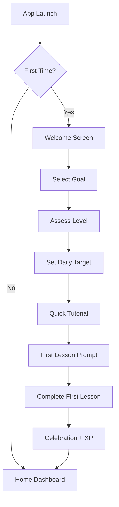
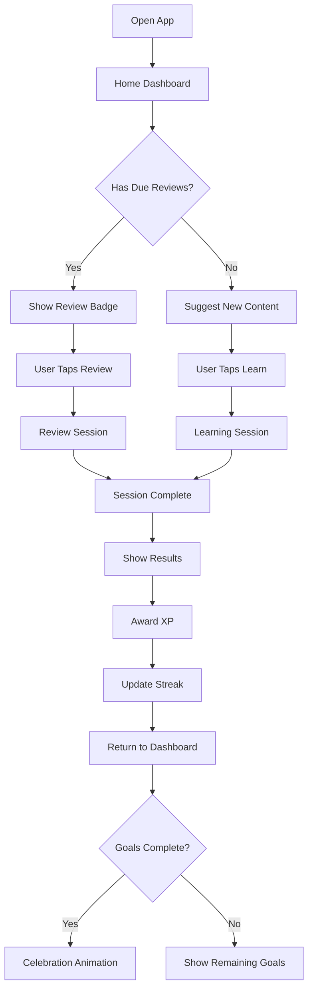
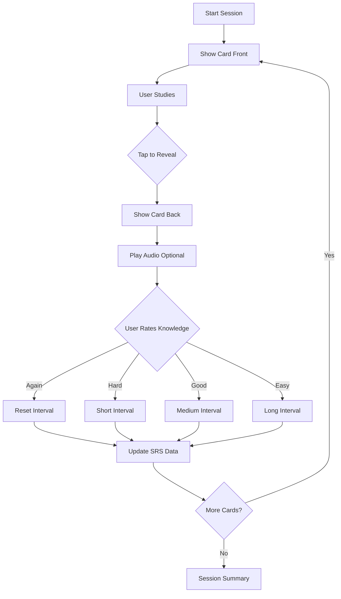
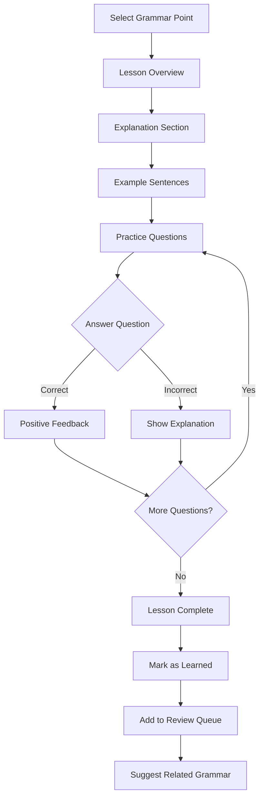
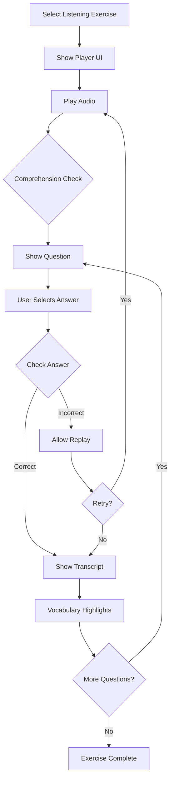
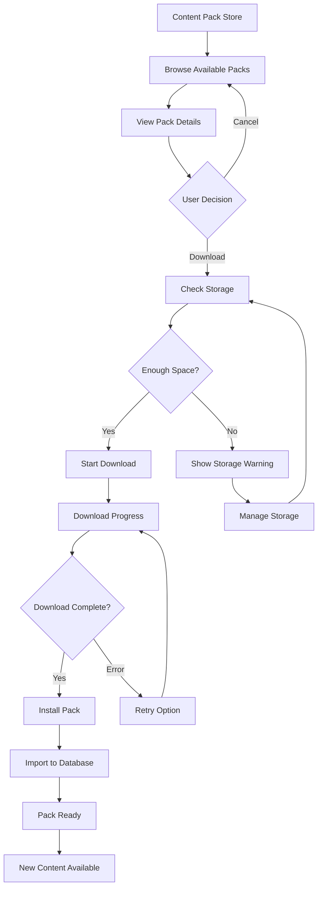
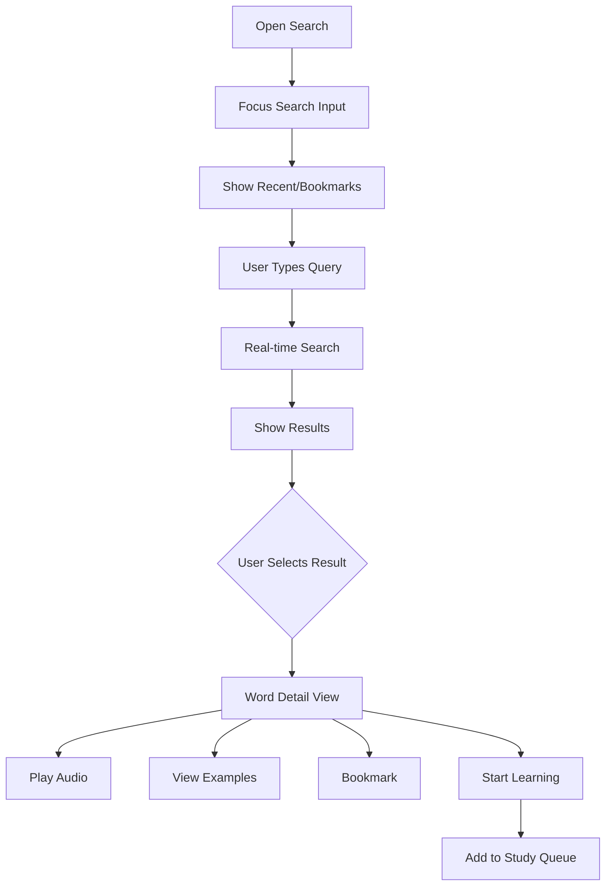
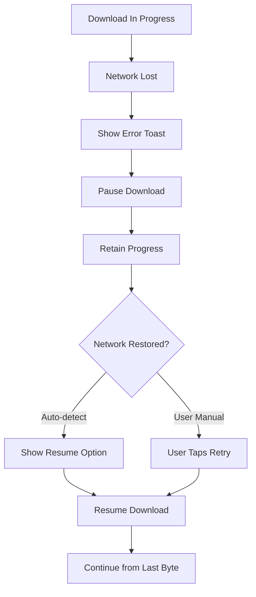
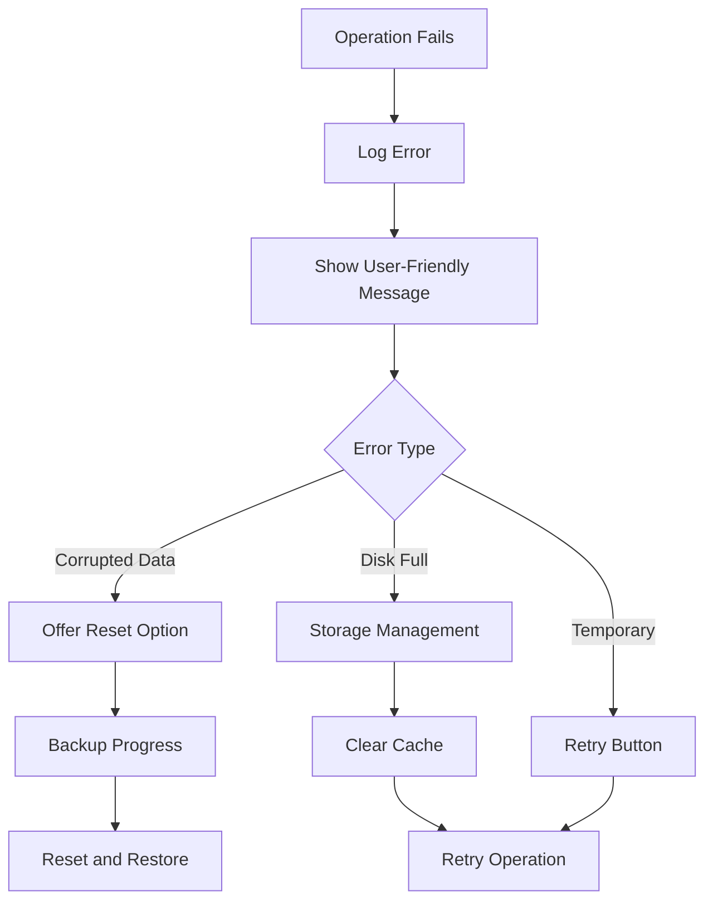

# JLearn - User Flows & Interaction Patterns

**Version:** 1.0  
**Date:** 2025-11-30  
**Status:** ⚠️ SUPERSEDED - See USER_FLOWS_LLM_SHELL.md  
**Related:** UX_DESIGN_JLEARN.md

---

> ⚠️ **IMPORTANT: This document has been superseded**
> 
> This user flows document was created for the original offline-first app model with pre-packaged content packs. The product has pivoted to an **LLM-powered learning shell** architecture.
> 
> **Please refer to:** 
> - [USER_FLOWS_LLM_SHELL.md](./USER_FLOWS_LLM_SHELL.md) - Updated user flows for LLM integration
> - [UX_DESIGN_LLM_SHELL.md](./UX_DESIGN_LLM_SHELL.md) - Updated UX design
> - [PRODUCT_VISION.md](./PRODUCT_VISION.md) - Product vision explaining the pivot
> 
> This document is retained for historical reference and may contain useful flow patterns for future features.

---

## 1. Core User Flows

### 1.1 First-Time User Experience (FTUE)



**Screen Details:**

| Screen | Purpose | Key Actions |
|--------|---------|-------------|
| Welcome | Set expectations | Single CTA: "Get Started" |
| Goal Selection | Personalize content | Multi-select options |
| Level Assessment | Skip beginner content if appropriate | Single-select, optional skip |
| Daily Target | Set achievable goals | Slider or presets |
| Tutorial | Teach core interactions | Interactive demo cards |
| First Lesson | Quick win (3-5 words) | Standard flashcard flow |
| Celebration | Positive reinforcement | Show XP, streak started |

---

### 1.2 Daily Learning Session



---

### 1.3 Vocabulary Flashcard Flow



**Interaction Details:**

```
Card Front State:
├── Display: Japanese word (kana + kanji)
├── Audio button (optional autoplay)
├── Progress indicator (12/50)
└── Actions: Tap to reveal, Skip

Card Back State:
├── Display: Translation + reading
├── Example sentences (collapsible)
├── Audio playback
└── Rating buttons (Again/Hard/Good/Easy)

Rating Behavior:
├── Again: Card reappears in 1 min
├── Hard: Card reappears in session end
├── Good: Card scheduled per SM-2
└── Easy: Card scheduled with longer interval
```

---

### 1.4 Grammar Lesson Flow



---

### 1.5 Listening Practice Flow



**Audio Player States:**

```
Initial:
├── Play button (prominent)
├── Duration indicator
└── Speed control (0.75x, 1x, 1.25x)

Playing:
├── Pause button
├── Progress bar (scrubbable)
├── Current time / Total time
└── Repeat button

Completed:
├── Replay button
├── Show transcript toggle
└── Next question prompt
```

---

### 1.6 Content Pack Download Flow



**Download States:**

```
Queued:
├── Pack name and size
├── "Waiting..." indicator
└── Cancel button

Downloading:
├── Progress bar (0-100%)
├── Downloaded / Total size
├── Estimated time remaining
├── Pause/Resume button
└── Cancel button

Installing:
├── "Installing..." spinner
├── Progress (importing data)
└── Non-cancellable

Complete:
├── Success checkmark
├── "Start Learning" button
└── Pack now in "Installed" tab

Error:
├── Error icon and message
├── Retry button
├── Cancel button
└── Offline mode tip
```

---

### 1.7 Search & Dictionary Flow



**Search Behavior:**

```
Input Handling:
├── Support: Japanese (hiragana, katakana, kanji)
├── Support: Romaji input
├── Support: English translation
├── Auto-detect input type
└── Fuzzy matching for typos

Results Ranking:
├── Exact match first
├── Starts-with match second
├── Contains match third
├── Translation match fourth
└── Limit: 50 results

Instant Actions:
├── Tap result → Detail view
├── Swipe right → Bookmark
├── Swipe left → Add to learning
└── Long press → Quick preview
```

---

## 2. Error Recovery Flows

### 2.1 Network Error During Download



### 2.2 Database Error Recovery



---

## 3. State Transitions

### 3.1 Learning Item States

```
┌─────────┐     Learn      ┌──────────┐
│   New   │ ─────────────→ │ Learning │
└─────────┘                └──────────┘
                                │
                                │ First Correct
                                ▼
                          ┌───────────┐
     ┌────────────────────│ Reviewing │←───────────┐
     │                    └───────────┘            │
     │                          │                  │
     │ Incorrect (Again)        │ 3+ Correct       │
     │                          ▼                  │
     │                    ┌──────────┐             │
     └───────────────────→│ Mastered │─────────────┘
                          └──────────┘   Decay/Error
```

### 3.2 Session States

```
Idle
  │
  │ Start Session
  ▼
Loading
  │
  │ Content Ready
  ▼
Active ←────────────────┐
  │                     │
  │ Complete Item       │ More Items
  ▼                     │
Processing ─────────────┘
  │
  │ No More Items
  ▼
Completed
  │
  │ View Results / Exit
  ▼
Idle
```

---

## 4. Gesture Mappings

### 4.1 Flashcard Gestures (Flutter)

```dart
// Gesture detection zones
GestureDetector(
  onTap: () => flipCard(),
  onDoubleTap: () => playAudio(),
  onHorizontalDragEnd: (details) {
    if (details.primaryVelocity! > 0) {
      // Swipe right → Easy/Know
      rateCard(Rating.easy);
    } else {
      // Swipe left → Again/Skip
      skipCard();
    }
  },
  onVerticalDragEnd: (details) {
    if (details.primaryVelocity! > 0) {
      // Swipe down → Show hint
      showHint();
    } else {
      // Swipe up → Flip card
      flipCard();
    }
  },
)
```

### 4.2 PWA Keyboard Shortcuts

```javascript
// Global shortcuts
const shortcuts = {
  'Space': 'flipCard / playAudio',
  'Enter': 'submitAnswer',
  'Escape': 'exitSession / closeModal',
  '1': 'rateAgain',
  '2': 'rateHard',
  '3': 'rateGood',
  '4': 'rateEasy',
  '/': 'focusSearch',
  '?': 'showHelp',
  'ArrowLeft': 'previousItem',
  'ArrowRight': 'nextItem',
  'Ctrl+B': 'bookmark',
  'Ctrl+S': 'saveProgress'
};
```

---

## 5. Notification Flows

### 5.1 Daily Reminder

```
Trigger: User-configured time (default 9:00 AM)

Notification Content:
├── Title: "Time to study Japanese! 🎌"
├── Body: "You have 12 reviews due. Keep your 15-day streak!"
├── Action 1: "Start Review" → Open Review Session
├── Action 2: "Remind Later" → Snooze 1 hour
└── Silent after 3 dismissals in a row

Deep Link: jlearn://review
```

### 5.2 Streak Warning

```
Trigger: 8:00 PM if no activity today

Notification Content:
├── Title: "Don't lose your streak! 🔥"
├── Body: "Complete just 1 review to keep your 15-day streak"
├── Action: "Quick Review" → 5-item mini session
└── Urgency: High (sound + vibration)

Deep Link: jlearn://quick-review
```

### 5.3 Content Pack Update

```
Trigger: New version available (checked on app open if online)

Notification Content:
├── Title: "Update Available: JLPT N5"
├── Body: "50 new vocabulary words added"
├── Action: "Update Now" → Content Pack Store
└── Only show if on WiFi

Deep Link: jlearn://packs/jlpt-n5
```

---

## 6. Analytics Events

### 6.1 Key Events to Track

```javascript
// Session events
analytics.track('session_start', { type: 'vocabulary', items: 10 });
analytics.track('session_complete', { type: 'vocabulary', correct: 8, time: 240 });
analytics.track('session_abandon', { type: 'vocabulary', progress: 6, reason: 'back' });

// Learning events
analytics.track('card_rate', { item_id: 'v123', rating: 'good', time_to_answer: 3.2 });
analytics.track('audio_play', { item_id: 'v123', speed: 1.0 });
analytics.track('hint_used', { item_id: 'v123', hint_type: 'first_letter' });

// Progress events
analytics.track('level_up', { new_level: 5, total_xp: 1250 });
analytics.track('achievement_unlock', { achievement: 'first_100_words' });
analytics.track('streak_milestone', { days: 30 });

// Content events
analytics.track('pack_download_start', { pack_id: 'jlpt-n5', size: 157286400 });
analytics.track('pack_download_complete', { pack_id: 'jlpt-n5', duration: 45 });
analytics.track('pack_download_error', { pack_id: 'jlpt-n5', error: 'network' });

// Search events
analytics.track('search', { query: 'eat', results: 15, language: 'en' });
analytics.track('search_result_tap', { query: 'eat', result_id: 'v456', position: 0 });
```

---

## 7. Offline Behavior Matrix

| Feature | Online | Offline | Transition |
|---------|--------|---------|------------|
| **Vocabulary Learning** | ✅ Full | ✅ Full | No change |
| **Grammar Lessons** | ✅ Full | ✅ Full | No change |
| **Listening** | ✅ Full | ✅ Cached audio | Show if unavailable |
| **Reading** | ✅ Full | ✅ Full | No change |
| **Search** | ✅ Full | ✅ Local DB only | No change |
| **Progress Sync** | ✅ Sync | 📦 Queue locally | Auto-sync when online |
| **Content Packs** | ✅ Download | ❌ Browse only | Show offline message |
| **Achievements** | ✅ Full | ✅ Local unlock | Sync when online |
| **Profile** | ✅ Sync | ✅ Local | Sync when online |

---

## 8. Loading States

### 8.1 Skeleton Screens

```
Dashboard Loading:
┌─────────────────────────────────────┐
│ ░░░░░░░░░░░░░░░░░░░░░░░ [░░░░░]     │
│ ░░░░░░░░░░                          │
├─────────────────────────────────────┤
│ ┌─────────────────────────────────┐ │
│ │ ░░░░░░░░░░░░░░░░░░░░░░░░░░░░░  │ │
│ │ ░░░░░░░░░░░░░░░░░░░░           │ │
│ │ ░░░░░░░░░░░                     │ │
│ └─────────────────────────────────┘ │
├─────────────────────────────────────┤
│ ░░░░░░░░░░░░░░░░░░░░░░             │
│ ┌───────────┐ ┌───────────┐        │
│ │ ░░░░░░░░  │ │ ░░░░░░░░  │        │
│ │ ░░░░░░░   │ │ ░░░░░░░   │        │
│ └───────────┘ └───────────┘        │
└─────────────────────────────────────┘
```

### 8.2 Progress Indicators

```
Determinate (downloads, imports):
├── Linear progress bar
├── Percentage text
└── Size/time remaining

Indeterminate (search, load):
├── Circular spinner (small actions)
├── Linear indeterminate (page load)
└── Shimmer effect (content load)

Context-specific:
├── Card: Pulse animation on placeholder
├── Audio: Waveform animation
├── List: Skeleton items (3-5)
└── Image: Blurred placeholder
```

---

## 9. Responsive Breakpoints

### 9.1 Layout Adaptations

```
Phone Portrait (< 600dp):
├── Bottom navigation bar
├── Single column content
├── Full-width cards
├── Stacked button groups
└── Collapsible sections

Phone Landscape (600-840dp):
├── Bottom navigation bar
├── Two-column grid for cards
├── Side-by-side buttons
└── Expanded player controls

Tablet Portrait (600-840dp):
├── Rail navigation (left)
├── Two-column layout
├── Larger touch targets
└── Side panel for details

Tablet Landscape (> 840dp):
├── Full navigation drawer
├── Three-column layout
├── Master-detail pattern
└── Persistent side panels

Desktop (> 1200dp, PWA):
├── Fixed sidebar navigation
├── Three-column with side panel
├── Hover states
├── Keyboard shortcuts active
└── Larger content area
```

### 9.2 Flashcard Responsiveness

```
Phone:
├── Card: Full width - 32dp padding
├── Japanese text: 32sp
├── Translation: 20sp
└── Buttons: Bottom fixed

Tablet:
├── Card: Max 500dp width, centered
├── Japanese text: 40sp
├── Translation: 24sp
└── Buttons: Below card

Desktop:
├── Card: Max 600dp width, centered
├── Japanese text: 48sp
├── Translation: 28sp
├── Keyboard shortcuts visible
└── Side panel: Examples & notes
```

---

## 10. Handoff Notes for Development

### 10.1 Flutter Implementation Priority

1. **Core Navigation** - Bottom nav, routing
2. **Home Dashboard** - Today's goals, continue cards
3. **Vocabulary Flashcards** - Card flip, SRS rating
4. **Local Database** - SQLite setup, repositories
5. **Audio Playback** - Pronunciation, listening
6. **Progress Tracking** - XP, streaks, stats
7. **Grammar Lessons** - Content display, practice
8. **Search & Dictionary** - Full-text search
9. **Content Packs** - Download, install, manage
10. **Settings** - Preferences, theme, notifications

### 10.2 PWA Implementation Priority

1. **Service Worker** - Offline caching strategy
2. **IndexedDB** - Mirror SQLite schema
3. **Responsive Layout** - Desktop-first, mobile adapt
4. **Keyboard Navigation** - Full accessibility
5. **Web Audio** - Pronunciation playback
6. **Push Notifications** - Reminder system
7. **Install Prompt** - PWA installation flow
8. **Sync Strategy** - Background sync for progress

### 10.3 Shared Components

```
Cross-Platform Components:
├── FlashCard (flip animation, rating)
├── ProgressBar (linear, circular)
├── AudioPlayer (controls, waveform)
├── SearchBar (autocomplete, filters)
├── StatCard (number, trend, icon)
├── AchievementBadge (icon, locked/unlocked)
├── StreakIndicator (fire icon, count)
├── LessonCard (progress, thumbnail)
├── ContentPackCard (size, download state)
└── EmptyState (icon, message, action)
```

---

**Document Status:** Draft - Ready for Review  
**Related Documents:** 
- `UX_DESIGN_JLEARN.md` - Design specifications
- `TECHNICAL_DESIGN.md` - Implementation details
- `PRODUCT_REQUIREMENTS.md` - Feature requirements
