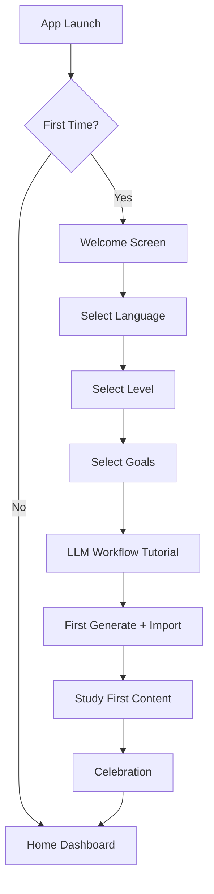
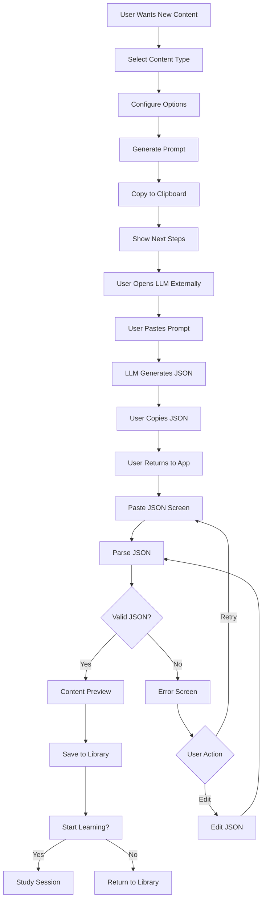
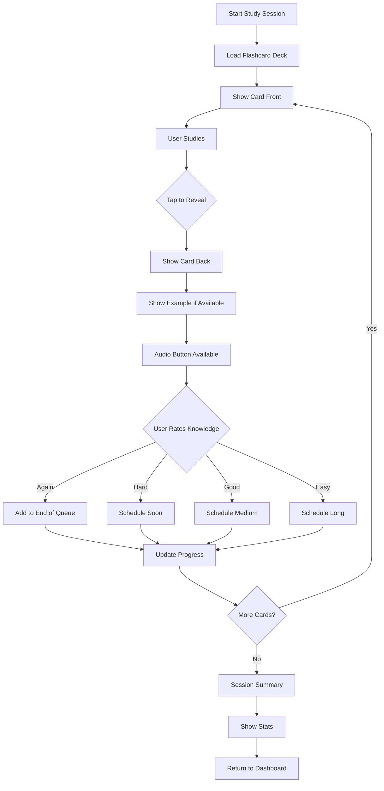
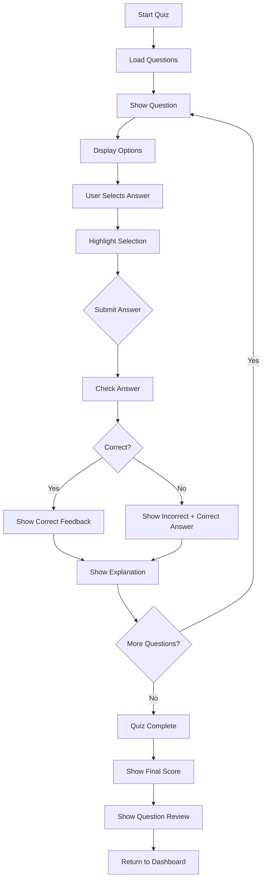
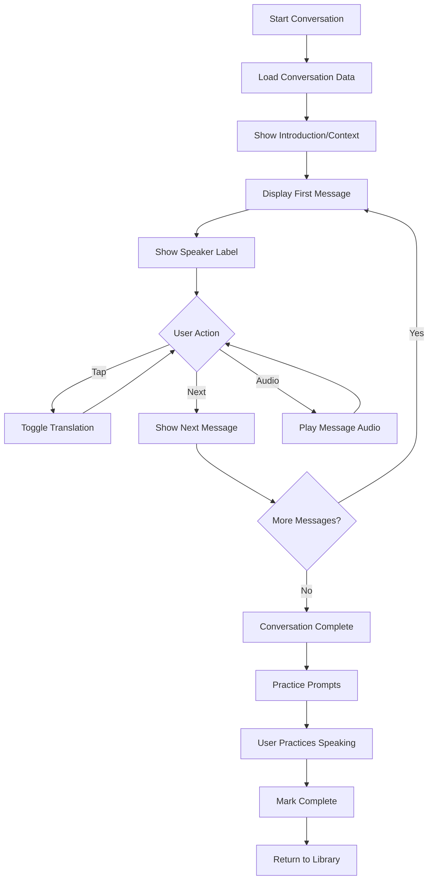
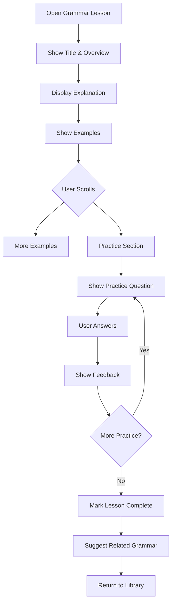
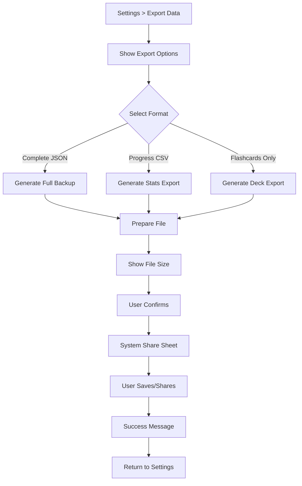
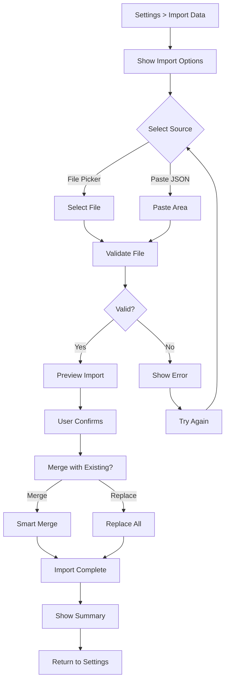
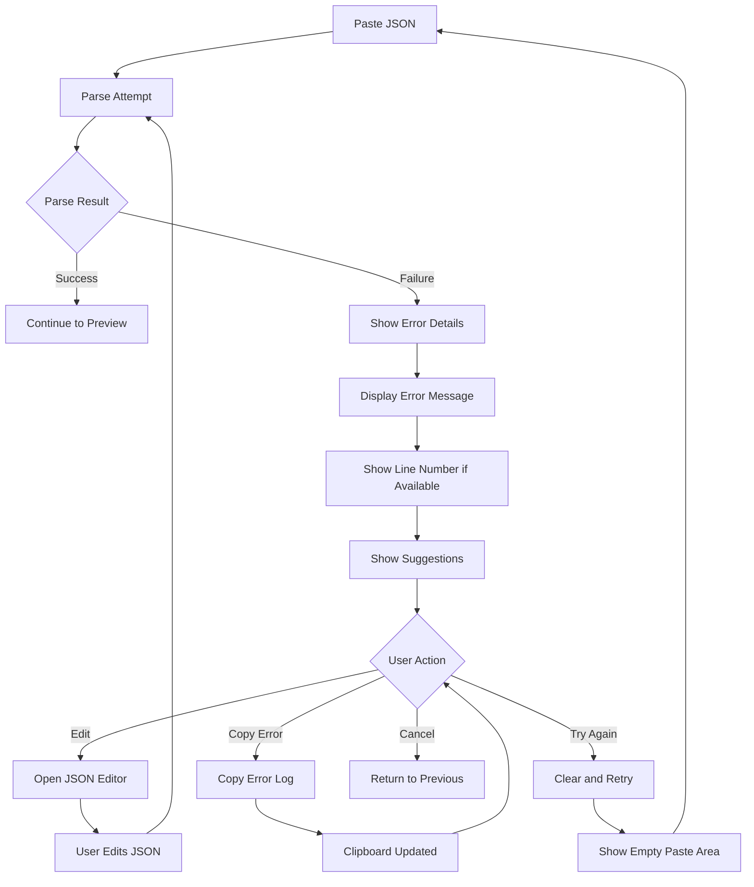
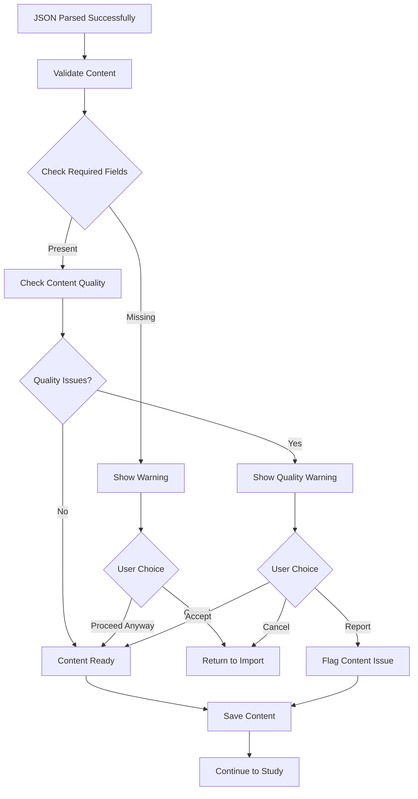

# JLearn - User Flows: LLM-Powered Shell

**Version:** 2.0  
**Date:** 2025-12-05  
**Status:** Aligned with Product Vision  
**Related:** UX_DESIGN_LLM_SHELL.md, PRODUCT_VISION.md, REQUIREMENTS_LLM_INTEGRATION.md

---

## 1. Core User Flows

### 1.1 First-Time User Experience (FTUE)



**Screen Details:**

| Step | Screen | Purpose | Key Actions |
|------|--------|---------|-------------|
| 1 | Welcome | Set expectations about LLM-powered learning | "Get Started" |
| 2 | Language | Choose target language | Single select |
| 3 | Level | Set proficiency (A1-C2) | Single select |
| 4 | Goals | Personalize content direction | Multi-select |
| 5 | Tutorial | Explain copy-paste workflow | Interactive demo |
| 6 | First Generate | Walk through generating first flashcards | Guided steps |
| 7 | First Import | Demonstrate JSON paste and parse | Paste + parse |
| 8 | First Study | Quick 5-card session | Flashcard flow |
| 9 | Celebration | Positive reinforcement | Show success |

---

### 1.2 Content Generation Flow (Core MVP Flow)



**State Details:**

```
Generate Prompt States:
├── Idle: Show content type options
├── Configuring: User selecting options
├── Generated: Prompt copied, showing instructions
└── Awaiting Import: User redirected to paste screen

Import States:
├── Empty: Waiting for paste
├── Pasting: Clipboard/text input active
├── Parsing: Processing JSON (loading)
├── Success: Content parsed, showing preview
├── Error: Parsing failed, showing help
└── Editing: User correcting JSON

Content Saved States:
├── New: Just imported, not studied
├── In Progress: Partially studied
├── Completed: All items reviewed
└── Archived: User archived content
```

---

### 1.3 Flashcard Study Flow



**Card Interaction Details:**

```
Card Front State:
├── Display: Target language text (Japanese)
├── Display: Secondary form (kanji/hiragana)
├── Progress indicator (8/20)
├── Audio button (optional)
└── Actions: Tap/Swipe to reveal, Skip

Card Back State:
├── Display: Translation
├── Display: Pronunciation (romaji)
├── Display: Example sentence (if available)
├── Audio playback button
└── Rating buttons: Again / Hard / Good / Easy

Gestures:
├── Tap card: Flip
├── Swipe up: Flip
├── Swipe left: Skip
├── Swipe right: Easy
└── Double tap: Play audio
```

---

### 1.4 Quiz Flow



**Quiz States:**

```
Question States:
├── Displaying: Question visible, no selection
├── Selected: One option highlighted
├── Submitted: Answer locked in
├── Revealed: Correct/incorrect shown
└── Explained: Explanation displayed

Results States:
├── Score display (7/10, 70%)
├── Performance summary
├── Question-by-question review
└── Retake or exit options
```

---

### 1.5 Conversation Practice Flow



---

### 1.6 Grammar Lesson Flow



---

## 2. Data Management Flows

### 2.1 Export Data Flow



**Export Data Guarantees:**

```
Data Ownership Promise:
├── 100% of user data exportable
├── No server required
├── Open JSON/CSV formats
├── Schema version included
├── Can export anytime
└── No restrictions or limits
```

---

### 2.2 Import Data Flow (Future)



---

## 3. Error Handling Flows

### 3.1 JSON Parsing Error Recovery



**Common Errors & Suggestions:**

| Error Type | Message | Suggestion |
|------------|---------|------------|
| Syntax Error | "Invalid JSON syntax" | Check for missing commas or brackets |
| Unexpected End | "JSON seems incomplete" | Make sure you copied the entire response |
| Markdown Wrapped | "Detected markdown code block" | Remove \`\`\`json markers |
| Wrong Schema | "JSON doesn't match expected format" | Use the prompt we provided |
| Empty Response | "No content to import" | Check that LLM generated content |

---

### 3.2 Content Validation Flow



**Validation Checks:**

```
Required Field Checks:
├── Flashcards: front, back present
├── Quiz: question, options, correct_answer
├── Conversation: speaker, message
└── Grammar: title, explanation

Quality Checks:
├── No empty strings in required fields
├── No placeholder text like "[example]"
├── Options array has correct length (quiz)
├── Correct answer is in options (quiz)
└── Language appears correct
```

---

## 4. Session State Management

### 4.1 Study Session States

```
Session Lifecycle:
┌─────────┐     Start      ┌──────────┐
│   Idle  │ ─────────────→ │ Loading  │
└─────────┘                └──────────┘
                                │
                                │ Content Ready
                                ▼
                          ┌───────────┐
     ┌────────────────────│  Active   │←───────────────┐
     │                    └───────────┘                │
     │                          │                      │
     │ Background/Interrupt     │ Complete Item        │
     ▼                          ▼                      │
┌──────────┐             ┌───────────┐                │
│  Paused  │             │ Processing│────────────────┘
└──────────┘             └───────────┘    More Items
     │                          │
     │ Resume                   │ No More Items
     ▼                          ▼
┌───────────┐            ┌───────────┐
│  Active   │            │ Completed │
└───────────┘            └───────────┘
                               │
                               │ Exit
                               ▼
                          ┌─────────┐
                          │  Idle   │
                          └─────────┘
```

### 4.2 Content Item States

```
Item Lifecycle:
┌─────────┐     Study      ┌──────────┐
│   New   │ ─────────────→ │ Learning │
└─────────┘                └──────────┘
                                │
                                │ Reviewed (any rating)
                                ▼
                          ┌───────────┐
                          │ Reviewing │
                          └───────────┘
                           /         \
                          /           \
              Incorrect  /             \ Correct 3+
                        ▼               ▼
               ┌───────────┐     ┌───────────┐
               │ Struggling │    │ Mastered  │
               └───────────┘     └───────────┘
                     │                 │
                     └─────────────────┘
                            │
                            │ Decay / Error
                            ▼
                     ┌───────────┐
                     │ Review Due│
                     └───────────┘
```

---

## 5. Navigation Patterns

### 5.1 Primary Navigation

```
Bottom Navigation Bar (Always Visible)
┌─────────────────────────────────────┐
│  [🏠]    [✨]      [📚]     [📊]   │
│  Home  Generate  Content Progress   │
└─────────────────────────────────────┘

Tab Behavior:
├── Home: Dashboard, recommendations
├── Generate: Content creation hub
├── Content: Library of all content
└── Progress: Stats and data export
```

### 5.2 Contextual Navigation

```
Generate Flow:
Home → Generate → Configure → Copy Prompt → Paste JSON → Preview → Study

Study Flow:
Content → Select Item → Study Session → Complete → Summary → Content

Settings Flow:
Any Screen → Profile Icon → Settings → Subsection → Return

Export Flow:
Progress → Export Data → Select Format → Confirm → Share Sheet
```

---

## 6. Gesture Mappings

### 6.1 Flashcard Gestures

```dart
// Flutter gesture implementation
GestureDetector(
  onTap: () => flipCard(),
  onDoubleTap: () => playAudio(),
  onHorizontalDragEnd: (details) {
    if (details.primaryVelocity! > 0) {
      // Swipe right → Easy
      rateCard(Rating.easy);
    } else {
      // Swipe left → Skip
      skipCard();
    }
  },
  onVerticalDragEnd: (details) {
    if (details.primaryVelocity! > 0) {
      // Swipe down → Show hint (if available)
      showHint();
    } else {
      // Swipe up → Flip card
      flipCard();
    }
  },
)
```

### 6.2 Content Library Gestures

```dart
// Swipe actions on content cards
Dismissible(
  // Swipe right → Start studying
  onDismissedRight: () => startStudy(item),
  
  // Swipe left → Delete/Archive
  onDismissedLeft: () => showDeleteConfirm(item),
  
  // Long press → Context menu
  onLongPress: () => showContextMenu(item),
)
```

---

## 7. Offline Behavior

### 7.1 Offline Capability Matrix

| Feature | Online | Offline | Notes |
|---------|--------|---------|-------|
| **Generate Prompt** | ✅ | ✅ | Prompt generation is local |
| **Copy Prompt** | ✅ | ✅ | Uses device clipboard |
| **Paste JSON** | ✅ | ✅ | Parsing is local |
| **Study Flashcards** | ✅ | ✅ | Content stored locally |
| **Take Quiz** | ✅ | ✅ | Content stored locally |
| **View Progress** | ✅ | ✅ | Stats stored locally |
| **Export Data** | ✅ | ✅ | Uses local file system |
| **LLM Integration** | ⚠️ | ❌ | User must access LLM externally |

### 7.2 Network Indicators

```
No special network indicators needed for MVP because:
├── All app functions work offline
├── LLM access is external (user's browser/app)
├── No server dependencies
└── No sync requirements

Future (API integration):
├── Show connectivity status
├── Queue API calls when offline
└── Sync when back online
```

---

## 8. Loading States

### 8.1 Skeleton Screens

```
Dashboard Loading:
┌─────────────────────────────────────┐
│ ░░░░░░░░░░░░░░░░░       [░░░░░]    │
├─────────────────────────────────────┤
│ ┌─────────────────────────────────┐ │
│ │ ░░░░░░░░░░░░░░░░░░░░░░░░░░░░░  │ │
│ │ ░░░░░░░░░░░░░░░░░░░░           │ │
│ └─────────────────────────────────┘ │
├─────────────────────────────────────┤
│ ░░░░░░░░░░░░░░░░░░                 │
│ ┌───────────┐ ┌───────────┐        │
│ │ ░░░░░░░░  │ │ ░░░░░░░░  │        │
│ │ ░░░░░░░   │ │ ░░░░░░░   │        │
│ └───────────┘ └───────────┘        │
└─────────────────────────────────────┘

JSON Parsing:
┌─────────────────────────────────────┐
│                                     │
│        ⏳ Parsing content...        │
│                                     │
│    ═══════════════════════════      │
│                                     │
│    Validating JSON structure...    │
│                                     │
└─────────────────────────────────────┘
```

### 8.2 Progress Indicators

```
Determinate (known length):
├── JSON parsing progress
├── Export generation
└── Deck loading

Indeterminate (unknown length):
├── Initial app load
├── Complex validation
└── Data cleanup
```

---

## 9. Analytics Events (Local Only)

Since the app is local-first with no servers, analytics are for local insights only:

```
// Stored locally for progress features
LocalAnalytics.log('content_generated', {
  type: 'flashcard',
  topic: 'food',
  level: 'A2',
  count: 10
});

LocalAnalytics.log('study_session_complete', {
  type: 'flashcard',
  items_reviewed: 20,
  accuracy: 0.75,
  duration_seconds: 300
});

LocalAnalytics.log('content_imported', {
  type: 'quiz',
  questions: 10,
  parsing_success: true
});

LocalAnalytics.log('data_exported', {
  format: 'json',
  size_bytes: 2457600,
  items_count: 245
});
```

---

## 10. Responsive Breakpoints

### 10.1 Layout Adaptations

```
Phone Portrait (< 600dp):
├── Bottom navigation bar
├── Single column layout
├── Full-width cards
├── Stacked buttons
└── Bottom sheets for options

Phone Landscape (600-840dp):
├── Bottom navigation bar
├── Two-column grid for content
├── Side-by-side buttons
└── Larger touch targets

Tablet Portrait (600-840dp):
├── Rail navigation (left)
├── Two-column layout
├── Split view for generate flow
└── Side panel for help

Tablet Landscape / Desktop (> 840dp):
├── Full navigation drawer
├── Three-column layout
├── Master-detail for content library
├── Persistent help panel
└── Keyboard shortcuts visible
```

### 10.2 Flashcard Responsiveness

```
Phone:
├── Card: Full width - 32dp padding
├── Japanese text: 32sp
├── Translation: 20sp
└── Buttons: Bottom fixed

Tablet:
├── Card: Max 500dp width, centered
├── Japanese text: 40sp
├── Translation: 24sp
└── Buttons: Below card

Desktop (PWA):
├── Card: Max 600dp width, centered
├── Japanese text: 48sp
├── Translation: 28sp
├── Keyboard shortcuts active
└── Side panel: Examples visible
```

---

## 11. Handoff Notes for Development

### 11.1 Implementation Priority

1. **Onboarding Flow** - First-time user setup
2. **Prompt Generation** - Core value proposition
3. **JSON Import** - Parse and validate
4. **Flashcard Study** - Primary learning component
5. **Content Library** - Manage imported content
6. **Quiz Component** - Secondary learning component
7. **Progress Tracking** - Stats and history
8. **Data Export** - Fulfill data ownership promise
9. **Settings** - Profile and preferences
10. **Conversation & Grammar** - Extended content types

### 11.2 Shared Components

```
Core Components:
├── PromptGeneratorCard (type selection, options)
├── CopyButton (clipboard with feedback)
├── JSONPasteArea (paste, validate, preview)
├── FlashCard (flip animation, rating)
├── QuizQuestion (options, submit, feedback)
├── ProgressBar (linear, determinate)
├── ContentCard (library item, swipe actions)
├── EmptyState (icon, message, action)
├── ErrorState (icon, message, suggestions)
└── ExportButton (format selection, share sheet)
```

### 11.3 Key User Journeys to Test

```
Journey 1: First Content Generation
├── Open app first time
├── Complete onboarding
├── Generate flashcard prompt
├── Copy, use LLM, get JSON
├── Paste and import
├── Study first cards
└── See progress update

Journey 2: Returning User Session
├── Open app
├── See recommendations
├── Continue studying content
├── Complete session
├── Check progress
└── Export data (optional)

Journey 3: Error Recovery
├── Paste malformed JSON
├── See helpful error message
├── Edit JSON in app
├── Successfully import
└── Continue learning
```

---

**Document Status:** Draft - Aligned with Product Vision  
**Related Documents:** 
- `UX_DESIGN_LLM_SHELL.md` - Design specifications
- `PRODUCT_VISION.md` - Product strategy
- `USER_STORIES_MVP.md` - User stories
- `REQUIREMENTS_LLM_INTEGRATION.md` - Technical requirements

